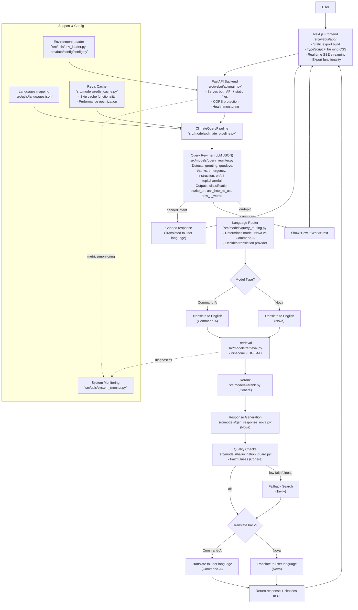

## System Architecture

The diagram below reflects the current production architecture with FastAPI backend, Next.js frontend, intelligent model routing, comprehensive multilingual support, and advanced safety filtering.

## Architecture Notes

### Production Deployment
- **Single Deployment Model**: FastAPI serves both API endpoints and Next.js static files
- **Static Export**: Next.js builds to static files for optimal performance
- **Port 8000**: All traffic (frontend + API) goes through FastAPI on port 8000

### Intelligent Features
- **Canned Responses**: greeting/goodbye/thanks/emergency bypass retrieval for fast responses
- **Safety Filtering**: Off-topic/harmful queries return helpful guidance messages
- **Cache Bypass**: Retry functionality skips cache for fresh responses
- **Manual Language Selection**: Users can anchor language selection to prevent auto-detection

### Model Routing
- **Command‑A (22 languages)**: Arabic, Bengali, Chinese, Filipino, French, Gujarati, Korean, Persian, Russian, Tamil, Urdu, Vietnamese, Polish, Turkish, Dutch, Czech, Indonesian, Ukrainian, Romanian, Greek, Hindi, Hebrew
- **Nova (6 languages)**: English, Spanish, Japanese, German, Swedish, Danish
- **Automatic Detection**: System detects user language and routes to appropriate model

### Performance Optimizations
- **Redis Caching**: Improves response times with intelligent bypass
- **Static Assets**: Optimized builds with compression
- **Streaming Responses**: Server-sent events for real-time user experience
- **Language Detection**: <100ms response time for language identification

