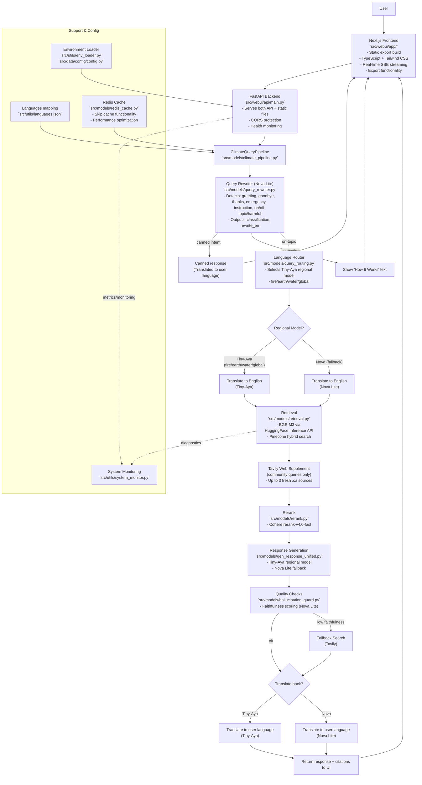

## System Architecture

The diagram below reflects the current production architecture (updated Feb 2026) with FastAPI backend, Next.js frontend, Cohere Tiny-Aya regional model routing, HuggingFace-hosted embeddings, and community-specific RAG with Tavily web supplement.

## Architecture Notes

### Production Deployment
- **Single Deployment Model**: FastAPI serves both API endpoints and Next.js static files
- **Static Export**: Next.js builds to static files for optimal performance
- **Port 8000**: All traffic (frontend + API) goes through FastAPI on port 8000
- **Azure App Service**: B1/B2 plan sufficient (~$13-26/mo) — all inference is API-based, no local ML models

### Intelligent Features
- **Canned Responses**: greeting/goodbye/thanks/emergency bypass retrieval for fast responses
- **Safety Filtering**: Off-topic/harmful queries return helpful guidance messages
- **Cache Bypass**: Retry functionality skips cache for fresh responses
- **Manual Language Selection**: Users can anchor language selection to prevent auto-detection
- **Community-Specific Knowledge**: System prompt includes verified Thorncliffe Park data with hallucination guard for other communities
- **Tavily Web Supplement**: Community queries automatically pull fresh web results from trusted .ca domains

### Model Routing (Cohere Tiny-Aya Regional)
- **Tiny-Aya Fire (South Asian)**: Hindi, Bengali, Punjabi, Urdu, Gujarati, Tamil, Telugu, Marathi, Nepali, Sinhala, Malayalam, Kannada, Odia, Assamese, Sindhi, Kashmiri
- **Tiny-Aya Earth (African)**: Swahili, Yoruba, Hausa, Igbo, Amharic, Somali, Kinyarwanda, Shona, Zulu, Xhosa, and 10 more
- **Tiny-Aya Water (Asia-Pacific + Europe)**: Chinese, Japanese, Korean, Thai, Vietnamese, Indonesian, Arabic, Hebrew, Persian, Turkish, Russian, Ukrainian, Polish, Czech, Romanian, Greek, French, German, Spanish, Italian, Portuguese, Dutch, Swedish, Danish, Norwegian, Finnish, and more
- **Tiny-Aya Global (default)**: English + all languages not covered above
- **Nova Lite (fallback)**: Used for query rewriting, classification, and faithfulness evaluation

### Embeddings & Retrieval
- **BGE-M3** via HuggingFace Inference API (1024-dim dense vectors)
- **Pinecone** hybrid search (dense + sparse, alpha=0.5)
- **Cohere rerank-v4.0-fast** for document reranking
- **No local models**: All inference is API-based (~200MB install vs previous ~2.2GB)

### Performance Optimizations
- **Redis Caching**: Improves response times with intelligent bypass
- **Static Assets**: Optimized builds with compression
- **Streaming Responses**: Server-sent events for real-time user experience
- **Language Detection**: <100ms response time for language identification
- **API-only architecture**: Cold start ~30s (vs ~2-3min with local torch models)
