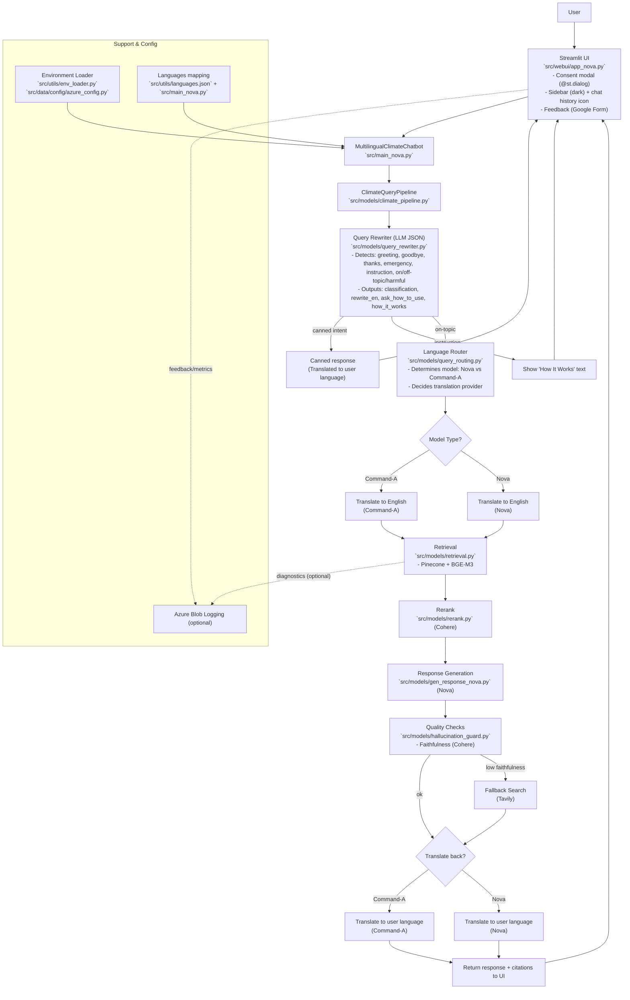

## System Architecture

The diagram below reflects the current architecture after recent refactors (consent modal overlay, LLM JSON query rewriter, canned responses, Pinecone retrieval with BGE-M3, Cohere rerank/faithfulness, Azure blob logging, and multilingual support).

Notes
- Canned intents (greeting/goodbye/thanks/emergency) bypass retrieval and generation, returning quickly with translated canned text.
- Instruction queries short-circuit to a fixed help text.
- Off-topic/harmful are handled per pipeline checks.
- Local JSONL logs are disabled by default; Azure blob logging remains available when configured.

### Command‑A Language Routing
- Command‑A languages are routed to use Command‑A for translation (both to English and back to the user’s language). Retrieval, rerank, and response generation remain the same.
- The current Command‑A language set is defined in `src/utils/languages.json` and mirrored in `src/main_nova.py`.

